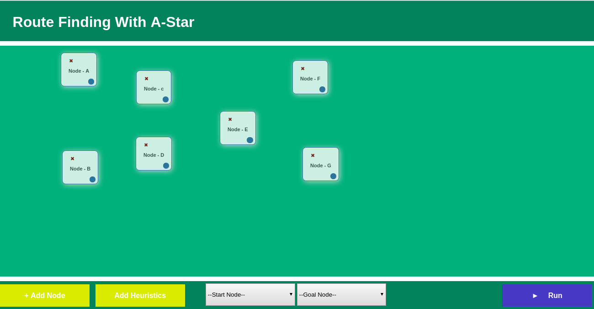
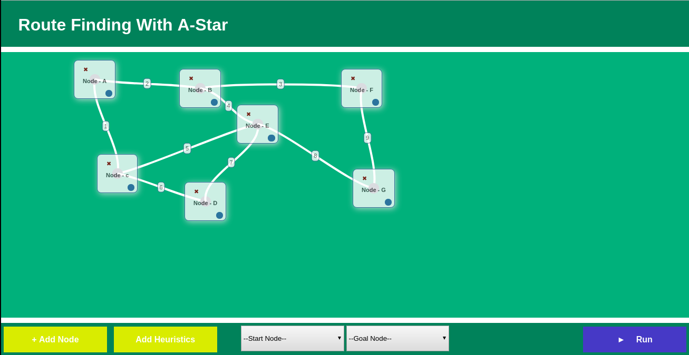
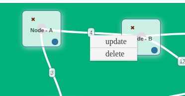
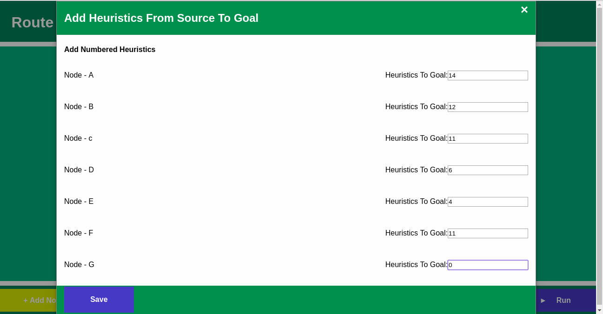

# A-Star Search (To Find Shortest Path)
A* (A-star) search implementation with JavaScript. The app Lets Users Create their own nodes heuristics and costs, then the algorithm can find the shortest path from the starting node to the goal node.

A-Star search is an informed search strategy to find shotest path from a starting node to a goal node.It considers both estimated cost of getting from n to the goal node h(n), and cost of getting from initial node to node n, g(n) 

- g(n): Cost of path found so far from initial state to n 
- h(n): Estimated cost of shortest path from n to z 
- f(n): Estimated total cost of shortest path from a to z via n
- Evaluation function f(n) = h(n) + g(n)

### Demo Site URL
http://a-star-search.herokuapp.com/

# Runing Locally
- First Run ```npm install``` in the app's directory.
- Then Run ```npm start``` to start the app server

##How it works
- Fist Add the nodes (places) you want by clicking the Add Node button and give your node a unique name when prompted. Then Drag the nodes to the desired space.

- Create Connections between the nodes. Hold and drag the blue button on the nodes to create a connection line and place the line on the desired destination node.

- Click on the connection's cost number to edit it to the desired cost of path i.e g(n). When prompted click update and enter the desired cost.

- From the drop down menus Select the start node and goal node of your path.
[!Select goal and start node](img/Fourth.png)
- Next click the 'Add Heuristics' button to and add the individual heuritics to goal i.e h(n) when prompted.

- Finally Click run to get the shortest path from the algorithm.

## Example
Here is an a-star search example: http://www.101computing.net/a-star-search-algorithm/
